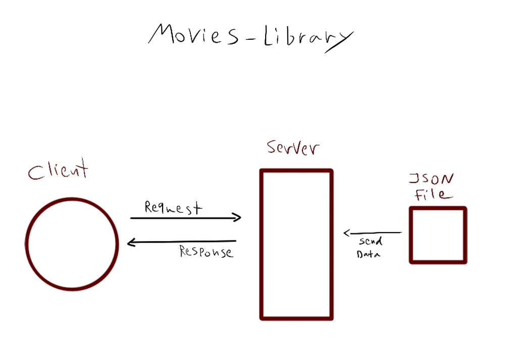

# movies-library - Lab 14

**Author Name**: Sham Al-Jalam.

## WRRC

## Overview
I've created movie library app by building a server using Node.js, Express.js and CORS, and nodemon in order for the server to be updated automatically ,and dotenv in order to be able to create global variables, alongside with axios to do different kind of http methods.
## Getting Started
1. open from a client
2. enter the valid URL
3. if the URL requires query params don't forget to specify them

## Project Features
* show trending movies
* search through the movies by by passing the movie's name and the page's number in the URL as query params
* show similar movies by passing an ID for that movie in the URL as query param
* show available regions