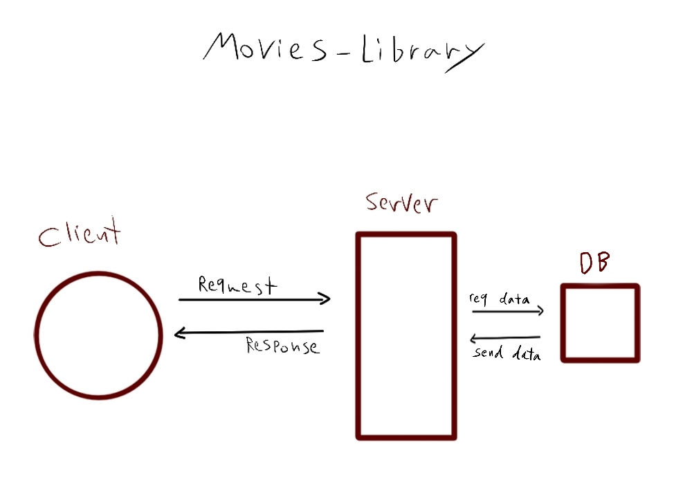

# movies-library - Lab 15

**Author Name**: Sham Al-Jalam.

## WRRC

## Overview
I've created a database to get and send data to it by get and post requests.
## Getting Started
1. open from a client
2. enter the valid URL
3. if the URL requires query params don't forget to specify them

## Project Features
* get movies from the table in the database
* add movie to the table in the database